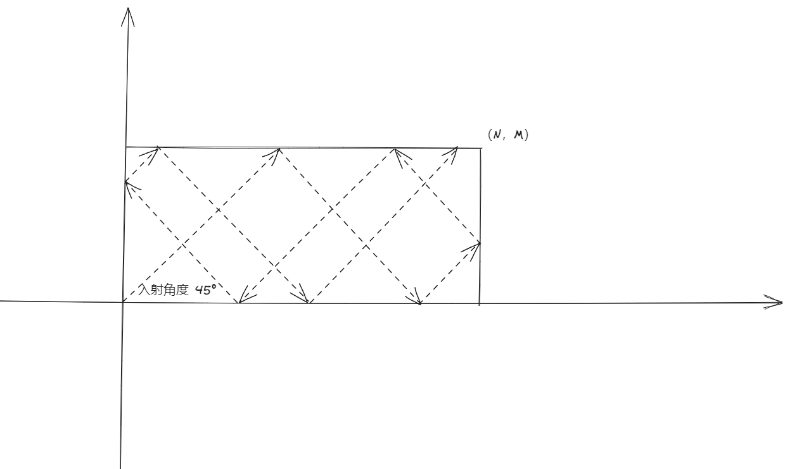

最近面试考到一个很有意思的题目， 难倒是不难，但是比较考验逻辑的缜密性 ；

> 在一个整数直角坐标系内有一个点 （n，m） ，与 坐标系围成了一个矩形，现有一个小球（不考虑碰撞体积，材料等客观因素）从 （0，0） 位置45°角发射，每次碰撞矩形都会有规则的进行反弹，求小球每次碰撞点的坐标。


下面是我根据题目意思画的简要草图， 以及小球的前进路线，很遗憾的是我在当时面试的时候没有在规定时间内吧完整的代码写出来，面试完后想吧该题目记录下来，我当时的方案是使用最简答的，将小球所有的碰撞可能性都列举出来，然后针对每种路线都推算出小球的碰撞点，暂时还没有更好的解体思路。




代码参考 ： 

```java
public class Demo {
    @Test
    public void main() {
        // 这儿定义 key 为 发射的角度
        // key = 1 ， 小球从 水平面 向右上方发射
        // key = 2 ， 小球从 水平面 向左上方发射
        // key = 3 ， 小球从 水平面 向右下方发射
        // key = 4 ， 小球从 水平面 向左下方发射
        // key = 5 ， 小球从 垂直面 向右上方发射
        // key = 6 ， 小球从 垂直面 向左上方发射
        // key = 7 ， 小球从 垂直面 向右下方发射
        // key = 8 ， 小球从 垂直面 向左下方发射
        int key = 1;
        int x = 0;
        int y = 0;
        int n = 5;
        int m = 5;
        foo(10,key,x,y,n,m);
    }
    
    public void foo(int count,int key, int x, int y, int n, int m){
        count = count-1;
        if(count <= 0)
            return;
        if(n == m){
            System.out.println("x:" + x + "   y:" + y);
            if(x == n) {
                x = 0;
                y = 0;
            }else {
                x = n;
                y = n;
            }
            foo(count,key,x,y,n,m);
            return;
        }
        switch(key){
            // 此时 y = 0 , 小球从 水平面 向右上方发射
            case 1:
                // 击中 最上面 key 变为 3
                if(n-x>m){
                    y = m;
                    x = x+m;
                    key = 3;
                }
                // 击中 最右边 key 变为 6
                else {
                    y = n-x;
                    x = n;
                    key = 6;
                }
                break;
            // 此时 y = 0 , 小球从 水平面 向左上方发射
            case 2:
                // 击中 最上面 key 变为 4
                if(x>m){
                    x = x-m;
                    y = m;
                    key = 4;
                }
                // 击中 最左边 key 变为 5
                else {
                    y = x;
                    x = 0;
                    key = 5;
                }
                break;
            // 此时 y = m , 小球从 水平面 向右下发射
            case 3:
                // 击中 最右边 key 变为 8
                if(n-x<m){
                    y = m-(n-x);
                    x = n;
                    key = 8;
                }
                // 击中 最下面 key 变为 1
                else {
                    y = 0;
                    x = x+m;
                    key = 1;
                }
                break;
            // 此时 y = m ， 小球从 水平面 向左下方 发射
            case 4:
                // 击中 最左边 key 变为 7
                if(x<m){
                    y = m-x;
                    x = 0;
                    key = 7;
                }
                // 击中 最下边 key 变为 2
                else {
                    x = x-y;
                    y = 0;
                    key = 2;
                }
                break;
            // 此时 x = 0 ， 小球从 垂直面 向右上方发射
            case 5:
                // 击中 最上面 key 变为 3
                if(m-y<n){
                    x = m-y;
                    y = m;
                    key = 3;
                }
                // 击中 最右边 key 变为 6
                else {
                    y = y+n;
                    x = n;
                    key = 6;
                }
                break;
            // 此时 x = n ， 小球从 垂直面 向左上方发射
            case 6:
                // 击中 最上面 key 变为 4
                if(m-y<n){
                    x = n-(m-y);
                    y = m;
                    key = 4;
                }
                // 击中 最左面 key 变为 5
                else {
                    y = y+n;
                    x = 0;
                    key = 5;
                }
                break;
            // 此时 x = 0 ， 小球从 垂直面 向右下方发射
            case 7:
                // 击中 最下面 key 变为 1
                if(y<n){
                    x = y;
                    y = 0;
                    key = 1;
                }
                // 击中 最右边 key 变为 8
                else {
                    y = y-n;
                    x = n;
                    key = 8;
                }
                break;
            // 此时 x = n ， 小球从 垂直面 向左下方发射
            case 8:
                // 击中 最下面 key 变为 2
                if(y<n){
                    x = n-y;
                    y = 0;
                    key = 2;
                }
                // 击中 最左边 key 变为 7
                else {
                    y = y-n;
                    x = 0;
                    key = 7;
                }
                break;
        }
        System.out.println("x:"+x+"   y:"+y);
        foo(count,key,x,y,n,m);
        return;
    }
}
```

